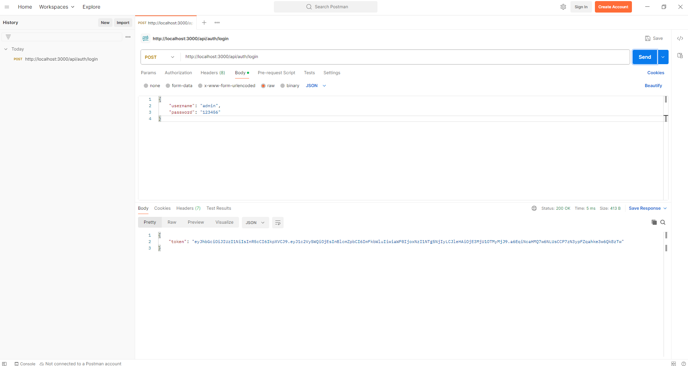
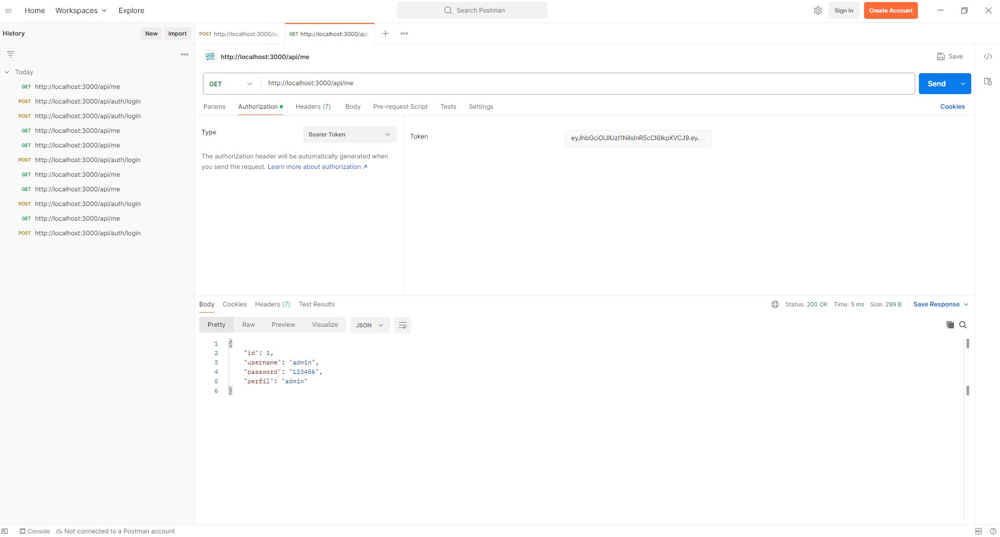
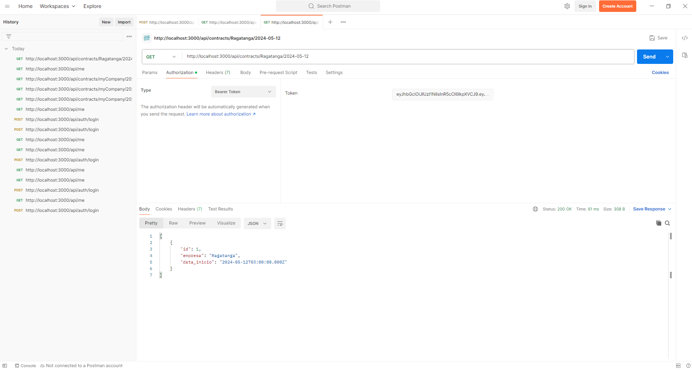

**Nome:** Jamison Queiroz\
**Matrícula:** 202208101127\
**Curso:** Desenvolvimento Full Stack\
**Turma:** 2022.4\
**Professor:** Guilherme Dutra Gonzaga Jaime\
**Disciplina:** Software Sem Segurança Nao Serve

## Missão Certificação Mundo 5

Este projeto tem o objetivo verificar a vulnerábilidade de um sistema de autenticação para gerenciar o acesso de usuários a uma API, utilizando JSON Web Tokens (JWT). O projeto aborda a criptografia de dados sensíveis, controle de sessão por meio de tokens, validação de perfis de usuário e implementação de segurança robusta, protegendo contra vulnerabilidades como token hijacking e SQL injection.

## Recursos

- Linguagem de programação JavaScript; 
- Banco de Dados Open Source PostgreSQL; 
- Versionado através do Git / Github;
- Postman

## Orientação

* O arquivo **mission.sql** contém uma cópia do banco utilizado.

## Executar e Testar

Para iniciar o servidor, navegue até a pasta aonde descompactou o aquivo através do cmd e execute:

Copiar código:
```
node index.js
```
- Agora, siga os passos no Postman para testar a API.

## Testando a API no Postman

- Abra o Postman e crie uma nova requisição POST para o endpoint http://localhost:3000/api/auth/login.
- No Body, escolha a opção raw e altere para JSON.
- Envie os seguintes dados no corpo da requisição:
```
{
    "username": "admin",
    "password": "123456"
}
```
- Isso retornará um token JWT, que será usado nas próximas requisições.

  

## Testar Requisição Protegida (Recuperar Usuário Logado)

- Crie uma nova requisição GET para o endpoint http://localhost:3000/api/me.
- Na aba Authorization, selecione o tipo Bearer Token e insira o token JWT gerado no login anterior.
- Envie a requisição. Se o token for válido, você verá os dados do usuário logado.



## Testar o Controle de Acesso (Recuperar Contratos)

- Crie uma nova requisição GET para o endpoint http://localhost:3000/api/contracts/{empresa}/{inicio}.
- Exemplo Usado: http://localhost:3000/api/contracts/Ragatanga/2024-05-12.
- Na aba Authorization, selecione novamente o tipo Bearer Token e insira o token JWT do login de um usuário com perfil de admin.
- Se tudo estiver correto, você deverá receber os contratos cadastrados no banco de dados para a empresa e data fornecidos.




